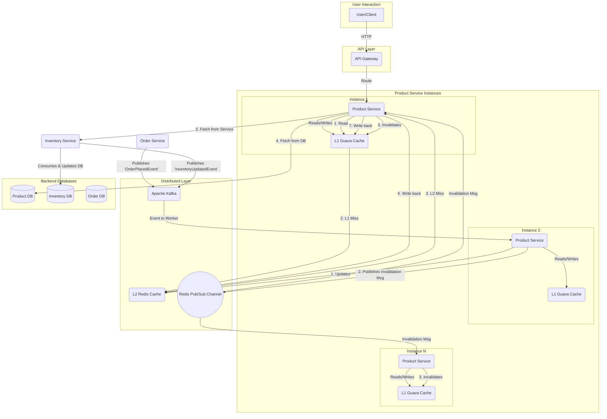
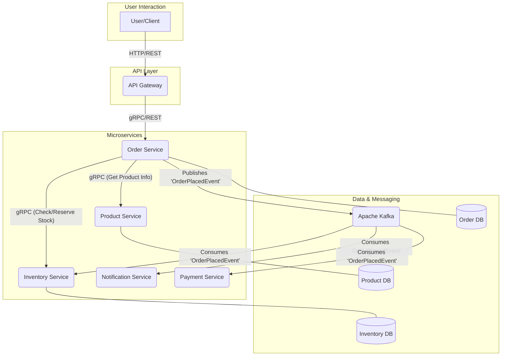

# Kế hoạch Triển khai Dự án E-commerce với gRPC và Kafka

## 1. Bối cảnh và Mục tiêu

Dự án này nhằm mục đích xây dựng một nền tảng e-commerce dựa trên kiến trúc microservices, tận dụng sức mạnh của **gRPC** cho giao tiếp nội bộ giữa các services và **Apache Kafka** cho các quy trình xử lý bất đồng bộ, hướng sự kiện.

**Mục tiêu chính:**
-   **Học tập & Nghiên cứu:** Nắm vững cách thiết kế, triển khai và vận hành gRPC và Kafka trong một hệ thống thực tế.
-   **Hiệu suất cao:** Xây dựng hệ thống có độ trễ thấp cho các tác vụ quan trọng.
-   **Khả năng mở rộng:** Kiến trúc cho phép từng service có thể được mở rộng độc lập.
-   **Tính nhất quán và sẵn sàng cao:** Đảm bảo dữ liệu được nhất quán giữa các service và hệ thống có khả năng phục hồi tốt.

## 2. Case Study: Quy trình Đặt hàng Toàn diện

Chúng ta sẽ tập trung vào luồng nghiệp vụ quan trọng nhất: **"Người dùng đặt một đơn hàng"**. Luồng này chạm đến nhiều services và là ví dụ hoàn hảo để minh họa sự kết hợp giữa gRPC và Kafka.

### 2.1. Tối ưu hóa Luồng xem Sản phẩm (Kiến trúc Caching 2 Lớp)

**Thách thức:**
Vào những ngày khuyến mãi lớn, lượng truy cập để xem chi tiết sản phẩm và kiểm tra tồn kho tăng đột biến. Việc truy vấn trực tiếp vào CSDL sẽ gây quá tải.

**Giải pháp (Hoàn thiện): Caching 2 Lớp (L1/L2) và Chống Cache Stampede**

Chúng ta sẽ triển khai một hệ thống cache 2 lớp để tối ưu hiệu suất đọc:
-   **L1 Cache (Local Cache - Guava):** Cache trong bộ nhớ của từng instance `Product Service`. Cung cấp tốc độ truy cập nhanh nhất (in-memory, không qua mạng).
-   **L2 Cache (Distributed Cache - Redis):** Cache phân tán, dùng chung cho tất cả các instance.

**Luồng đọc dữ liệu:**
1.  Khi có yêu cầu xem sản phẩm, `Product Service` sẽ tìm trong L1 Cache (Guava).
2.  Nếu **L1 miss**, tìm tiếp trong L2 Cache (Redis).
3.  Nếu **L2 miss** (đây là lúc cần chống Cache Stampede):
    a.  Sử dụng một cơ chế khóa (`Guava LoadingCache` hoặc `Lock`) để **chỉ một luồng duy nhất** được phép đi tiếp. Các luồng khác sẽ chờ.
    b.  Luồng được đi tiếp sẽ truy vấn CSDL và gRPC, lấy dữ liệu, sau đó ghi vào L2 (Redis) và L1 (Guava).
    c.  Các luồng đang chờ sau đó sẽ đọc được dữ liệu mới từ L1 cache.

**Làm sao để Cache luôn nhất quán? -> Kết hợp Kafka và Redis Pub/Sub**
1.  **Cập nhật dữ liệu (DB -> L2):** Khi có thay đổi (vd: `InventoryUpdatedEvent`), một worker sẽ nghe sự kiện từ Kafka và cập nhật dữ liệu mới vào L2 Cache (Redis).
2.  **Hủy bỏ L1 Cache (L2 -> L1 Invalidation):**
    a.  Ngay sau khi cập nhật L2 Cache, worker này sẽ `PUBLISH` một thông điệp nhỏ (chỉ chứa `productId`) vào một Redis Channel (vd: `product-invalidation`).
    b.  Tất cả các instance của `Product Service` đều `SUBSCRIBE` channel này.
    c.  Khi nhận được thông điệp, mỗi instance sẽ tự động xóa (invalidate) `productId` tương ứng khỏi L1 Cache (Guava) của mình. Lần gọi tiếp theo sẽ miss L1, đọc từ L2 đã được cập nhật, và ghi lại vào L1.

**Sơ đồ kiến trúc cập nhật với Caching 2 Lớp:**


### 2.2. Luồng sự kiện chi tiết (Saga Pattern):

1.  **Khởi tạo (Client -> Order Service):**
    -   Người dùng gửi yêu cầu đặt hàng (`POST /orders`) đến **API Gateway**.
    -   **API Gateway** chuyển tiếp yêu cầu đến **Order Service**.

2.  **Giai đoạn Xác thực & Tạm giữ (Order Service - gRPC Sync):**
    -   **Order Service** nhận yêu cầu. Để đảm bảo tính hợp lệ, nó thực hiện các cuộc gọi gRPC đồng bộ:
        -   Gọi `ProductService.GetProductInfo` để xác thực sản phẩm và lấy giá mới nhất.
        -   Gọi `InventoryService.ReserveStock` để kiểm tra và **tạm giữ** số lượng sản phẩm trong kho.
    -   Nếu một trong hai bước này thất bại, toàn bộ giao dịch bị hủy và báo lỗi ngay cho người dùng.
    
    **❓ Tại sao cần gọi `ProductService.GetProductInfo` thay vì tin tưởng giá từ client?**
    
    Đây là nguyên tắc **"Never trust the client"** trong bảo mật hệ thống:
    
    -   **Lý do bảo mật:** Client (frontend/mobile app) có thể bị tấn công hoặc modify:
        - Người dùng có thể thay đổi giá sản phẩm trong request bằng browser developer tools.
        - Malicious users có thể tạo request giả với giá 1 VND cho iPhone.
        - Bot/script có thể gửi request với giá bất kỳ.
        
    -   **Tính nhất quán giá:** Giá sản phẩm có thể thay đổi liên tục:
        - Flash sale: giá giảm đột ngột trong 5 phút.
        - Dynamic pricing: giá thay đổi theo supply/demand.
        - Admin có thể update giá bất cứ lúc nào.
        - Nếu dùng giá từ client, có thể user mua được hàng với giá cũ đã expired.
        
    -   **Source of Truth:** `ProductService` là single source of truth cho thông tin sản phẩm:
        - Đảm bảo giá được lấy từ database chính thức.
        - Áp dụng được các business rules (discount, promotion, tax).
        - Validate sản phẩm có tồn tại và đang active không.
        
    -   **Ví dụ kịch bản tấn công:**
        **Client gửi request giả với:**
        - productId: "IPHONE_15_PRO"  
        - quantity: 1
        - price: 1000 VND (trong khi giá thật là 25,000,000 VND)
        
        → Nếu hệ thống tin tưởng giá này, công ty sẽ mất 24,999,000 VND!
         
    **⚠️ Race Condition: Giá thay đổi giữa lúc check và order?**
    
    Đây là vấn đề thực tế trong e-commerce systems. Các strategies xử lý:
    
    -   **Strategy 1 - Optimistic Locking với Version:**
        - Mỗi lần cập nhật giá, tăng version number của product.
        - Khi order, gửi kèm version đã check.
        - Nếu version không khớp → giá đã thay đổi → reject order và yêu cầu user refresh.
        
    -   **Strategy 1B - CAS (Compare-And-Swap) Alternative:**
        - **Ưu điểm:** Atomic operation, performance cao hơn, ít storage overhead.
        - **Cách hoạt động:** `UPDATE products SET price = newPrice WHERE id = productId AND price = expectedPrice`
        - **Implementation:**
            - ProductService thực hiện atomic update với điều kiện giá hiện tại phải khớp.
            - OrderService validate giá thông qua ProductService trước khi tạo đơn hàng.
            - Nếu giá không khớp, throw exception và yêu cầu user refresh.
        - **So sánh Optimistic Locking vs CAS:**
            | Aspect | Optimistic Locking | CAS |
            |--------|-------------------|-----|
            | Storage | Cần thêm version column | Không cần thêm column |
            | Performance | Slower (2 queries) | Faster (1 atomic query) |
            | Complexity | Higher | Lower |
                         | Debugging | Easier (có version history) | Harder |
             | Concurrency | Good | Excellent |
         
         **🚨 LIMITATION trong Microservice Architecture:**
         
         CAS chỉ hoạt động trong **single database transaction**, nhưng microservice có separate databases. Do đó, ta sẽ sử dụng **Optimistic Locking với gRPC**.
         
         **👑 SOLUTION:**
         
         **Optimistic Locking với gRPC** - Tốt nhất cho User Experience:
         
         **Luồng xử lý trong OrderService:**
         1. Nhận request tạo order từ client (bao gồm productId, expectedPrice, priceVersion)
         2. Gọi ProductService.validatePriceWithVersion() qua gRPC để kiểm tra giá và version
         3. Nếu giá/version không khớp → throw PriceChangedException
         4. Nếu hợp lệ → tạo order record trong database
         5. Trả về order đã tạo cho client
         
         **🛡️ ProductService Implementation:**
         
         **Luồng xử lý validatePriceWithVersion:**
         1. Nhận productId, expectedPrice, version từ OrderService
         2. Truy vấn database để lấy product hiện tại
         3. So sánh version và price hiện tại với expectedPrice, version từ client
         4. Nếu khớp → return ProductInfo để OrderService tiếp tục
         5. Nếu không khớp → return null để báo hiệu giá đã thay đổi
         
         **📱 Frontend Flow:**
         
         **Luồng xử lý trên Frontend:**
         1. **Load product:** Gọi API để lấy thông tin sản phẩm (bao gồm price và version)
         2. **User click order:** Gửi request tạo order với productId, expectedPrice, priceVersion
         3. **Xử lý response:**
            - **Success:** Hiển thị thông báo đặt hàng thành công
            - **PriceChangedException:** Refresh product data và thông báo "Giá đã thay đổi"
         4. **Error Recovery:** User có thể xem giá mới và quyết định đặt hàng lại

    -   **Implementation:**
        - Frontend gửi kèm `productId`, `expectedPrice`, và `priceVersion` khi tạo order.
        - OrderService validate thông qua ProductService.
        - Nếu giá/version không khớp → throw `PriceChangedException`.
        - Frontend handle exception và refresh product data.

### 2.2. Xử lý Idempotency - Tránh Duplicate Orders

**🚨 Vấn đề quan trọng:** Trong môi trường distributed, các request có thể bị duplicate do:
- **Network timeout** → User click "Đặt hàng" lại
- **Double click** → 2 requests cùng lúc
- **Client retry logic** → Mobile app auto-retry khi network error
- **Browser back/forward** → User submit form nhiều lần

**💡 Giải pháp: Idempotency Key Strategy**

**Nguyên tắc cốt lõi:**
> Cùng một idempotency key → Cùng một kết quả, không tạo duplicate

**Implementation Strategy:**

1. **Client-side Generation:**
   - **Format:** `{userId}_{timestamp}_{randomString}` 
   - **Example:** `user123_20241201143022_abc789`
   - **Storage:** Lưu trong localStorage/sessionStorage để tránh regenerate khi retry
   - **Lifecycle:** Tạo mới cho mỗi user intent (mỗi lần click "Đặt hàng")

2. **Server-side Processing (OrderService):**
   
   **Luồng xử lý với Idempotency:**
   1. **Extract version** từ request body
   2. **Check orders table:** Tìm kiếm trong bảng `orders` với version từ request
   3. **Nếu version đã tồn tại:**
      - Trả về existing order (order_id, status) từ lần trước
      - **Không xử lý lại** → Tránh duplicate order
      - Response time nhanh (chỉ query, không logic nghiệp vụ)
   4. **Nếu version chưa tồn tại:**
      - Thực hiện full logic tạo order (validate giá, reserve inventory, etc.)
      - **Lưu order record** vào `orders` table với version
      - Return kết quả cho client

3. **Database Schema - Thêm trường version vào bảng orders:**
   ```sql
   orders table:
   - id (VARCHAR(50), PRIMARY KEY)
   - user_id (VARCHAR(50), NOT NULL)
   - product_id (VARCHAR(50), NOT NULL)
   - quantity (INT, NOT NULL)
   - price (DECIMAL(10,2), NOT NULL)
   - version (VARCHAR(100), NOT NULL) -- Idempotency key
   - status (ENUM: pending, confirmed, cancelled)
   - created_at (TIMESTAMP, DEFAULT CURRENT_TIMESTAMP)
   - UNIQUE KEY uk_version (version) -- Đảm bảo version unique
   ```

4. **Race Condition Handling:**
   - **Unique constraint** trên `version` column của orders table
   - **Nếu INSERT conflict:** Retry read từ orders table (another request đã xử lý)
   - **Database-level protection** → Không thể có duplicate versions

**🔧 Integration với Order Flow:**

**Luồng OrderService.createOrder() với Idempotency:**
1. **Extract version** từ request body
2. **Check orders table** xem đã có order nào với version này chưa
3. **Nếu version exists → Return existing order** (idempotent response)
4. **Nếu version not exists:**
   - Validate giá với ProductService (như cũ)
   - Reserve inventory với InventoryService
   - Create order record **với version** trong orders table
   - Return result

**Error Handling:**
- **Missing version:** Reject request (400 Bad Request)
- **Version format invalid:** Reject request với detailed error
- **Duplicate version:** Return existing order (idempotent behavior)

**Performance Considerations:**
- **Index trên version:** Faster duplicate detection
- **Index trên user_id:** Faster user-specific queries
- **Natural cleanup:** Orders tự cleanup theo business logic (không cần TTL riêng)

### 2.3. Luồng sự kiện chi tiết (Saga Pattern)

3.  **Khởi động Saga (Order Service - Kafka Async):**
    -   Nếu xác thực thành công, **Order Service** tạo một bản ghi đơn hàng trong CSDL của mình với trạng thái `PENDING`.
    -   Nó publish một sự kiện **`OrderPlacedEvent`** vào topic `orders` của Kafka. Đây là tín hiệu bắt đầu cho một chuỗi các hành động bất đồng bộ.
    
    **Xử lý lỗi tại bước này:**
    -   **Lỗi khi tạo bản ghi đơn hàng:** Nếu việc tạo record trong database thất bại, cần rollback toàn bộ giao dịch:
        - Gọi `InventoryService.ReleaseStock` (gRPC) để giải phóng số lượng hàng đã tạm giữ.
        - Trả về lỗi cho người dùng ngay lập tức.
        
    -   **Lỗi khi publish event vào Kafka:** Đây là tình huống phức tạp nhất (distributed transaction problem):
        - **Approach 1 - Transactional Outbox Pattern:** 
            - Trong cùng một database transaction, vừa tạo order record, vừa tạo một "outbox event" record.
            - Một background job riêng sẽ scan outbox table và publish event vào Kafka.
            - Chỉ khi publish thành công thì xóa outbox record.
        - **Approach 2 - Compensating Action:** 
            - Nếu publish thất bại, đánh dấu order status là `FAILED` trong database.
            - Tạo một scheduled job để retry publish event, hoặc trigger compensating actions.
            - Gọi `InventoryService.ReleaseStock` để giải phóng stock đã tạm giữ.
        
    -   **Timeout & Retry Strategy:**
        - Implement retry logic với exponential backoff cho việc publish vào Kafka.
        - Thiết lập timeout hợp lý (vd: 5 giây) để tránh user chờ quá lâu.
        - Sau khi hết timeout, chuyển sang compensating action.

4.  **Xử lý Thanh toán (Payment Service):**
    -   **Payment Service** (Consumer) lắng nghe topic `orders`.
    -   Khi nhận được `OrderPlacedEvent`, nó bắt đầu quy trình thanh toán (mô phỏng việc gọi API của Stripe, PayPal...).
    -   Sau khi có kết quả, nó publish một sự kiện mới: **`PaymentCompletedEvent`** (với trạng thái `SUCCESS` hoặc `FAILED`) vào topic `payment-outcomes`.

5.  **Xử lý Thông báo (Notification Service):**
    -   **Notification Service** (Consumer) cũng lắng nghe topic `orders`.
    -   Khi nhận `OrderPlacedEvent`, nó độc lập gửi một email "Cảm ơn đã đặt hàng" cho người dùng. Hoạt động của service này không ảnh hưởng đến các luồng khác.

6.  **Hoàn tất hoặc Hủy đơn (Order Service & Inventory Service):**
    -   **Order Service** cũng lắng nghe topic `payment-outcomes`.
    -   **Kịch bản THÀNH CÔNG:**
        -   Khi nhận được `PaymentCompletedEvent` với trạng thái `SUCCESS`, **Order Service** cập nhật trạng thái đơn hàng trong CSDL thành `CONFIRMED`.
        -   **Order Service** có thể publish tiếp sự kiện `OrderConfirmedEvent`.
        -   **Inventory Service** (lắng nghe `OrderConfirmedEvent` hoặc `PaymentCompletedEvent`) sẽ chuyển trạng thái của số lượng hàng từ "tạm giữ" thành "đã bán" (commit a transaction).
        -   Cuối cùng, **Inventory Service** publish sự kiện **`InventoryUpdatedEvent`** để thông báo cho toàn hệ thống rằng kho đã thay đổi.
    -   **Kịch bản THẤT BẠI:**
        -   Khi nhận được `PaymentCompletedEvent` với trạng thái `FAILED`, **Order Service** cập nhật trạng thái đơn hàng thành `CANCELLED`.
        -   **Order Service** publish sự kiện `OrderCancelledEvent`.
        -   **Inventory Service** (lắng nghe `OrderCancelledEvent`) sẽ **hoàn trả** lại số lượng hàng đã tạm giữ vào kho.
        -   **Inventory Service** cũng publish `InventoryUpdatedEvent` để cập nhật lại số lượng tồn kho.

7.  **Đồng bộ Cache (Product Service):**
    -   Worker trong **Product Service** lắng nghe `InventoryUpdatedEvent`.
    -   Khi nhận sự kiện, nó sẽ cập nhật lại cache trong Redis (L2) và gửi tín hiệu qua Redis Pub/Sub để vô hiệu hóa cache ở các L1 khác, khép kín vòng đời của dữ liệu.

## 3. Đề xuất Kiến trúc

Đây là sơ đồ kiến trúc ở mức cao, thể hiện sự tương tác giữa các thành phần.



### 3.1. Giao tiếp đồng bộ với gRPC

gRPC sẽ được dùng cho các tương tác yêu cầu-phản hồi (request-response) có độ trễ thấp, nơi mà service gọi cần một câu trả lời ngay lập tức để tiếp tục xử lý.

**Ví dụ định nghĩa file `.proto` cho `Inventory Service`:**

```proto
// inventory.proto
syntax = "proto3";

package inventory;

option java_package = "com.vietbank.inventoryservice.grpc";
option java_multiple_files = true;

// Service để quản lý kho
service InventoryService {
  // Kiểm tra và tạm giữ hàng trong kho
  rpc CheckAndReserveStock(StockRequest) returns (StockResponse);
}

// Yêu cầu kiểm tra kho
message StockRequest {
  string productId = 1;
  int32 quantity = 2;
}

// Phản hồi từ việc kiểm tra kho
message StockResponse {
  bool isAvailable = 1;
  string message = 2;
}
```

### 3.2. Giao tiếp bất đồng bộ với Kafka

Kafka được dùng để tách rời các service. Khi một service hoàn thành một nghiệp vụ, nó sẽ "thông báo" cho toàn hệ thống biết. Các service khác quan tâm đến sự kiện đó sẽ tự động xử lý mà không làm chậm service gốc.

**Ví dụ cấu trúc sự kiện `OrderPlacedEvent` (dạng JSON):**

```json
{
  "orderId": "ORD-12345",
  "userId": "USR-67890",
  "items": [
    {
      "productId": "PROD-ABC",
      "quantity": 2,
      "price": 50000.0
    }
  ],
  "totalAmount": 100000.0,
  "timestamp": "2024-07-31T10:00:00Z"
}
```

## 4. Lộ trình Triển khai (Roadmap)

Chúng ta sẽ chia dự án thành các giai đoạn nhỏ để dễ quản lý và đạt được kết quả nhanh chóng.

### Giai đoạn 1: Thiết lập Nền tảng
Mục tiêu: Chuẩn bị môi trường để các service có thể chạy và giao tiếp với nhau.

1.  **Containerize & Orchestration:**
    -   `Task 1.1`: Viết `Dockerfile` cho mỗi microservice.
    -   `Task 1.2`: Tạo file `docker-compose.yml` để khởi chạy các services cùng với Kafka, Zookeeper, **Redis**, và cơ sở dữ liệu (vd: PostgreSQL).
2.  **API Gateway:**
    -   `Task 1.3`: Thiết lập Spring Cloud Gateway để định tuyến các yêu cầu bên ngoài vào service tương ứng.

### Giai đoạn 2: Xây dựng luồng gRPC đầu tiên (`Product Service`)
Mục tiêu: Triển khai thành công một luồng giao tiếp gRPC hoàn chỉnh.

1.  **Định nghĩa gRPC:**
    -   `Task 2.1`: Tạo project `common-protos` để chứa các file `.proto` dùng chung.
    -   `Task 2.2`: Định nghĩa `product.proto` cho các nghiệp vụ của Product Service.
2.  **Triển khai Server (Product Service):**
    -   `Task 2.3`: Cấu hình `product-service` để build code gRPC từ file proto.
    -   `Task 2.4`: Viết logic cho gRPC service (vd: `CreateProduct`, `GetProductById`).
3.  **Triển khai Client (Test hoặc Gateway):**
    -   `Task 2.5`: Cấu hình một gRPC client trong `API Gateway` hoặc một project test riêng để gọi đến `Product Service` và xác nhận luồng hoạt động.

### Giai đoạn 3: Hoàn thiện Case Study Đặt hàng (`Order Service` với Kafka)
Mục tiêu: Tích hợp Kafka để hoàn thiện luồng đặt hàng.

1.  **Triển khai gRPC cho Order Service:**
    -   `Task 3.1`: Implement các gRPC client trong `order-service` để gọi đến `product-service` và `inventory-service`.
    -   `Task 3.2`: Viết logic xử lý đặt hàng (kết hợp các cuộc gọi gRPC).
2.  **Triển khai Idempotency Handling:**
    -   `Task 3.3`: Thêm trường `version` vào bảng `orders` với unique constraint.
    -   `Task 3.4`: Implement logic kiểm tra version trước khi xử lý order request.
    -   `Task 3.5`: Viết client-side logic để tạo version unique và gửi trong request body.
    -   `Task 3.6`: Implement error handling cho missing/invalid version scenarios.
3.  **Tích hợp Kafka Producer (Order Service):**
    -   `Task 3.7`: Cấu hình Kafka producer trong `order-service`.
    -   `Task 3.8`: Sau khi tạo đơn hàng thành công, publish `OrderPlacedEvent` ra Kafka topic.
4.  **Tích hợp Kafka Consumer (Notification & Inventory Service):**
    -   `Task 3.9`: Cấu hình Kafka consumer trong `notification-service` để lắng nghe `OrderPlacedEvent` và log ra thông báo.
    -   `Task 3.10`: Cấu hình Kafka consumer trong `inventory-service` để cập nhật lại số lượng tồn kho và publish sự kiện `InventoryUpdatedEvent`.

### Giai đoạn 4: Triển khai Caching cho Luồng xem sản phẩm
Mục tiêu: Tăng tốc độ phản hồi và giảm tải cho hệ thống khi xem sản phẩm (theo thiết kế đã mô tả ở section 2.1).
1.  **Triển khai Caching Logic:**
    -   `Task 4.1`: Cấu hình Redis trong `product-service`.
    -   `Task 4.2`: Implement logic đọc/ghi cache cho chức năng xem sản phẩm (theo luồng cache-aside pattern đã mô tả).
2.  **Triển khai Luồng cập nhật Cache:**
    -   `Task 4.3`: Cấu hình Kafka consumer trong `product-service` để lắng nghe sự kiện `InventoryUpdatedEvent` và `ProductUpdatedEvent`.
    -   `Task 4.4`: Viết logic để cập nhật hoặc xóa (invalidate) cache trong Redis khi nhận được sự kiện.
3.  **Triển khai Invalidation cho L1 Cache:**
    -   `Task 4.5`: Trong worker xử lý sự kiện Kafka, sau khi cập nhật Redis (L2), implement logic publish thông điệp invalidate vào Redis Pub/Sub channel.
    -   `Task 4.6`: Trong `product-service`, implement một Redis subscriber để lắng nghe channel và xóa key tương ứng khỏi Guava Cache (L1).

### Giai đoạn 5: Tích hợp Luồng Thanh toán (Payment Service)
Mục tiêu: Hoàn thiện quy trình nghiệp vụ với việc xử lý thanh toán cho đơn hàng.

1.  **Thiết kế Luồng Thanh toán:**
    -   `Task 5.1`: `Payment Service` lắng nghe sự kiện `OrderPlacedEvent` từ Kafka để bắt đầu xử lý thanh toán.
    -   `Task 5.2`: Mô phỏng việc gọi đến một cổng thanh toán bên thứ ba (ví dụ: Stripe, PayPal). Logic sẽ đơn giản là chờ một khoảng thời gian và sau đó trả về kết quả thành công/thất bại ngẫu nhiên.
    -   `Task 5.3`: Sau khi xử lý xong, `Payment Service` sẽ publish một sự kiện mới là `PaymentCompletedEvent` (chứa `orderId` và trạng thái `SUCCESS` hoặc `FAILED`) vào một topic Kafka mới (ví dụ: `payment-outcomes`).

2.  **Cập nhật Trạng thái Đơn hàng:**
    -   `Task 5.4`: Cấu hình `Order Service` để lắng nghe topic `payment-outcomes`.
    -   `Task 5.5`: Khi nhận được `PaymentCompletedEvent`, `Order Service` sẽ cập nhật trạng thái của đơn hàng tương ứng thành `CONFIRMED` (nếu thanh toán thành công) hoặc `CANCELLED` (nếu thanh toán thất bại).
    -   `Task 5.6 (Nâng cao)`: Nếu thanh toán thất bại, `Order Service` cần publish một sự kiện `OrderCancelledEvent` để `Inventory Service` có thể hoàn trả lại số lượng hàng đã tạm giữ.

## 6. Lộ trình Phát triển Kiến trúc (Về các yêu cầu phi chức năng)

Kế hoạch hiện tại tập trung vào việc làm chủ gRPC và Kafka một cách đơn giản nhất. Để đáp ứng đầy đủ các yêu cầu về **Tính mở rộng** và **Tính sẵn sàng cao**, chúng ta sẽ phát triển kiến trúc theo các giai đoạn sau:

### Giai đoạn A: Giao tiếp trực tiếp (Môi trường phát triển)
-   **Cách tiếp cận:** Các service gọi nhau trực tiếp qua tên service do Docker Compose cung cấp (ví dụ: `http://product-service:8080`). Điều này được Docker thực hiện tự động qua DNS nội bộ.
-   **Ưu điểm:** Cực kỳ đơn giản, không cần thêm thành phần, giúp tập trung tối đa vào logic nghiệp vụ.
-   **Hạn chế:** Chỉ hoạt động tốt với 1 instance cho mỗi service. Không có cơ chế phân phối tải (load balancing) hay tự động xử lý khi một instance chết. Chúng ta tạm chấp nhận hạn chế này trong giai đoạn đầu học tập.

### Giai đoạn B: Nâng cấp với Load Balancer (Nginx)
-   **Khi nào:** Sau khi các luồng nghiệp vụ chính đã hoạt động.
-   **Cách tiếp cận:** Thêm Nginx vào làm Load Balancer. Các service sẽ gọi đến Nginx thay vì gọi trực tiếp. Nginx sẽ phân phối tải đến nhiều instance của cùng một service.
-   **Mục tiêu học tập:** Hiểu rõ vai trò và cách cấu hình của một Load Balancer, đồng thời thấy được sự phức tạp của việc cập nhật cấu hình tĩnh khi các service thay đổi địa chỉ.

### Giai đoạn C: Tự động hóa hoàn toàn (Production-Ready với Kubernetes)
-   **Khi nào:** Khi dự án sẵn sàng cho môi trường tiệm cận production.
-   **Cách tiếp cận:** Di chuyển toàn bộ hệ thống sang môi trường Kubernetes. Tận dụng cơ chế Service Discovery và Load Balancing có sẵn và hoàn toàn tự động của Kubernetes.
-   **Mục tiêu:** Đạt được tính mở rộng và tính sẵn sàng cao một cách tự động và mạnh mẽ, đúng theo tiêu chuẩn ngành.

Bằng cách này, chúng ta vừa giữ được sự đơn giản để bắt đầu, vừa có một lộ trình rõ ràng để đạt được tất cả các mục tiêu phi chức năng đã đề ra.

## 7. Bước Tiếp theo

Kế hoạch của chúng ta giờ đã rất chi tiết và mạnh mẽ. Tôi đề nghị chúng ta bắt đầu với **Giai đoạn 1: Thiết lập Nền tảng**. Việc này sẽ tạo ra một bộ khung vững chắc cho việc phát triển các tính năng sau này.

Hãy review tài liệu này và cho tôi biết nếu bạn có bất kỳ câu hỏi hay muốn điều chỉnh gì nhé. 