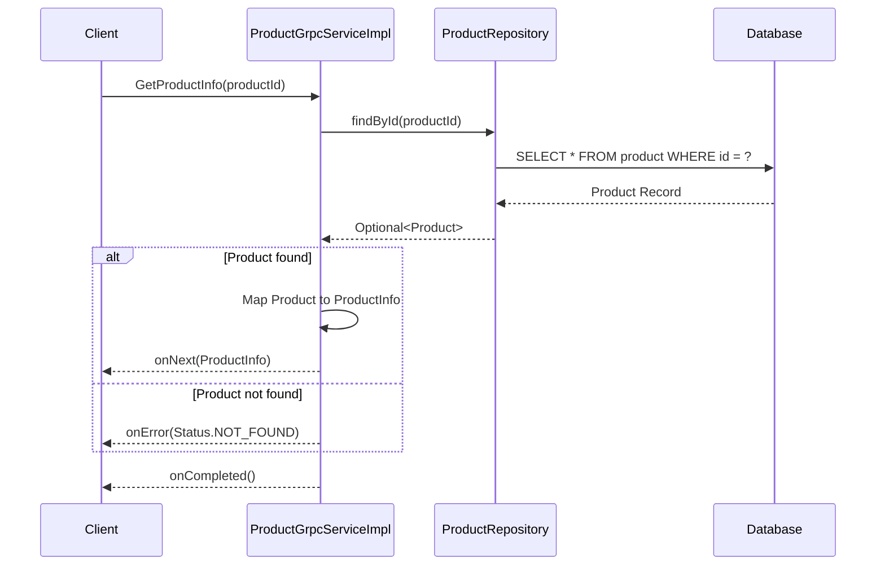

# Tài liệu Thiết kế Kỹ thuật: Product Service (gRPC Core)

## 1. Tổng quan

Service này đóng vai trò là "nguồn sự thật" (source of truth) cho tất cả thông tin liên quan đến sản phẩm, bao gồm giá, mô tả, và số lượng tồn kho. Mục tiêu ban đầu là xây dựng một nền tảng gRPC vững chắc để các service khác (ví dụ: `Order Service`) có thể truy vấn thông tin sản phẩm một cách hiệu quả và đáng tin cậy. Các tính năng nâng cao như caching phức tạp sẽ được triển khai trong các giai đoạn sau.

## 2. Yêu cầu

### 2.1 Yêu cầu Chức năng

*   **FR1:** Cung cấp một gRPC endpoint để truy vấn thông tin chi tiết của một sản phẩm dựa trên `productId`.

### 2.2 Yêu cầu Phi chức năng

*   **NFR1:** API phải có tính định kiểu mạnh (strongly-typed) để đảm bảo an toàn khi giao tiếp giữa các service.
*   **NFR2:** Service phải có khả năng khởi động độc lập và kết nối tới cơ sở dữ liệu.
*   **NFR3:** Phải có bộ kiểm thử (Unit & Integration) để đảm bảo chất lượng và tính đúng đắn của logic.

## 3. Thiết kế Kỹ thuật

### 3.1. Thay đổi Mô hình Dữ liệu

Một thực thể mới là `Product` sẽ được tạo ra để lưu trữ thông tin sản phẩm.

*   **Thực thể:** `Product`
*   **Các trường:**
    *   `id` (String, UUID, Primary Key)
    *   `name` (String)
    *   `description` (String)
    *   `price` (double)
    *   `quantity` (int)
*   **Sơ đồ ERD:**
    ```mermaid
    erDiagram
        Product {
            String id PK
            String name
            String description
            double price
            int quantity
        }
    ```

### 3.2. Thay đổi API

Một gRPC service mới `ProductService` sẽ được tạo ra.

*   **Service:** `ProductService`
*   **RPC Method:** `GetProductInfo`
*   **Định nghĩa Protobuf (`product.proto`):**
    ```protobuf
    syntax = "proto3";
    package product;
    option java_multiple_files = true;
    option java_package = "com.example.product.grpc";
    option java_outer_classname = "ProductProto";

    service ProductService {
      rpc GetProductInfo(GetProductRequest) returns (ProductInfo);
    }

    message GetProductRequest {
      string productId = 1;
    }

    message ProductInfo {
      string id = 1;
      string name = 2;
      string description = 3;
      double price = 4;
      int32 quantity = 5;
    }
    ```

### 3.3. Thay đổi UI
*   Không áp dụng. Đây là một backend service.

### 3.4. Luồng Logic

Luồng xử lý cho yêu cầu `getProductInfo` sẽ như sau:



### 3.5. Caching Strategy

*   **Giai đoạn 1 (Hiện tại):** Không áp dụng caching. Ưu tiên "Get It Working First".
*   **Giai đoạn 2 (Tương lai):** Sẽ triển khai kiến trúc caching 2 lớp (L1: Guava Cache, L2: Redis) để tối ưu hiệu suất đọc. Dữ liệu sẽ được đồng bộ qua Kafka.

### 3.6. Concurrency Handling

*   **Giai đoạn 1 (Hiện tại):** Với thao tác chỉ đọc (`getProductInfo`), cơ chế quản lý giao dịch (transaction management) mặc định của Spring Data JPA là đủ.
*   **Giai đoạn 2 (Tương lai):** Khi có các thao tác ghi (ví dụ: cập nhật số lượng), sẽ sử dụng cơ chế Optimistic Locking với trường `@Version` trong entity `Product` để ngăn chặn "lost updates".

### 3.7. Phụ thuộc

*   `common-protos`: Module chứa các định nghĩa Protobuf.
*   `io.github.lognet:grpc-spring-boot-starter`: Để tích hợp gRPC với Spring Boot.
*   `org.springframework.boot:spring-boot-starter-data-jpa`: Cho lớp persistence.
*   `com.h2database:h2`: Cơ sở dữ liệu in-memory cho môi trường dev/test.
*   `org.projectlombok:lombok`: Giảm code boilerplate.

### 3.8. Cân nhắc Bảo mật

*   Trong môi trường production, kênh giao tiếp gRPC cần được bảo mật bằng TLS (Transport Layer Security) để mã hóa dữ liệu. Cấu hình này sẽ được thực hiện ở giai đoạn sau.

### 3.9. Cân nhắc Hiệu suất

*   Cần đảm bảo cột `id` trong bảng `product` được đánh chỉ mục (index) để tối ưu tốc độ truy vấn.
*   Hiệu suất sẽ được cải thiện đáng kể trong giai đoạn 2 với Caching Strategy.

## 4. Kế hoạch Kiểm tra

*   **Unit Test:** Logic của `ProductGrpcServiceImpl` sẽ được kiểm tra một cách cô lập. `ProductRepository` sẽ được mock bằng Mockito để giả lập các tương tác với CSDL. Các kịch bản thành công và thất bại (không tìm thấy sản phẩm) đều sẽ được kiểm tra.
*   **Integration Test:** Toàn bộ luồng từ gRPC request đến CSDL sẽ được kiểm tra. Một môi trường Spring Boot đầy đủ sẽ được khởi chạy (`@SpringBootTest`). `grpc-testing` sẽ được sử dụng để tạo một server "in-process", giúp test chạy nhanh và ổn định mà không cần mở port thật.

## 5. Câu hỏi Mở

*   Không có câu hỏi nào cho giai đoạn triển khai gRPC core này.

## 6. Các Phương án Đã Xem xét

*   **REST vs. gRPC:** gRPC được chọn vì hiệu suất cao hơn (do sử dụng HTTP/2 và binary serialization), khả năng streaming hai chiều, và việc định nghĩa API chặt chẽ qua Protobuf, rất phù hợp cho giao tiếp nội bộ giữa các microservices. 