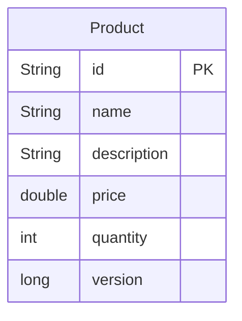
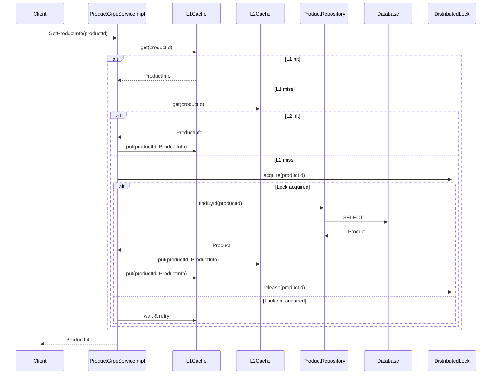

# Tài liệu Thiết kế Kỹ thuật: Product Service (gRPC + Multi-layer Caching)

## 1. Tổng quan

Product Service là nguồn sự thật (source of truth) cho thông tin sản phẩm (giá, mô tả, tồn kho). Mục tiêu: cung cấp API gRPC hiệu suất cao, đảm bảo dữ liệu nhất quán, khả năng mở rộng, và tối ưu hóa hiệu suất đọc qua kiến trúc caching 2 lớp (L1: Guava, L2: Redis), đồng bộ hóa qua Kafka/Redis PubSub.

## 2. Yêu cầu

### 2.1 Yêu cầu Chức năng
- Cung cấp gRPC endpoint truy vấn thông tin chi tiết sản phẩm theo productId.
- (Nâng cao) Validate giá và version để chống race condition khi cập nhật tồn kho.

### 2.2 Yêu cầu Phi chức năng
- API strongly-typed, hiệu suất cao, có thể mở rộng.
- Đảm bảo nhất quán dữ liệu giữa cache và DB.
- Có unit test, integration test, test cho cache hit/miss/invalidation.
- Đảm bảo bảo mật (TLS cho gRPC, bảo vệ Redis/Kafka).

## 3. Thiết kế Kỹ thuật

### 3.1. Thay đổi Mô hình Dữ liệu
- Entity: Product { id (UUID, PK), name, description, price, quantity, version }
- Đảm bảo index trên id, version.
- Sử dụng @Version cho optimistic locking.



### 3.2. Thay đổi API
- gRPC service: ProductService
- RPC: GetProductInfo, ValidatePriceWithVersion
- Định nghĩa Protobuf chuẩn hóa (product.proto)

```protobuf
syntax = "proto3";
package product;
option java_package = "com.example.productservice.grpc";
option java_multiple_files = true;
service ProductService {
  rpc GetProductInfo(GetProductRequest) returns (ProductInfo);
  rpc ValidatePriceWithVersion(ValidatePriceRequest) returns (ProductInfo);
}
message GetProductRequest { string productId = 1; }
message ValidatePriceRequest { string productId = 1; double expectedPrice = 2; int64 version = 3; }
message ProductInfo { string id = 1; string name = 2; string description = 3; double price = 4; int64 version = 5; int32 quantity = 6; }
```

### 3.3. Thay đổi UI
- Không áp dụng (backend service).

### 3.4. Luồng Logic
- Truy vấn: Client → gRPC → ProductGrpcServiceImpl → L1 Cache (Guava) → L2 Cache (Redis) → DB
- Nếu cache miss: sử dụng distributed lock để chống cache stampede, chỉ 1 thread load từ DB, các thread khác chờ.
- Khi update tồn kho: publish event Kafka, update L2, pub/sub invalidate L1 trên các instance.



### 3.5. Caching Strategy
- **L1: Guava Cache** (per instance, maxSize=10000, expireAfterWrite=10min)
- **L2: Redis** (shared, TTL=1h, cache-aside pattern)
- **Cache Invalidation**: Khi update, invalidate L2, publish Redis Pub/Sub để các instance invalidate L1.
- **Chống cache stampede**: Distributed lock (Redisson) khi cache miss.
- **Key pattern**: product:{id}
- **Monitoring**: Expose cache stats, Redis health, lock metrics.

### 3.6. Concurrency Handling
- **Optimistic Locking**: @Version trên Product, kiểm tra version khi update.
- **Distributed Lock**: Redisson lock theo productId khi cache miss.
- **Retry/Timeout**: Exponential backoff khi acquire lock thất bại.
- **Deadlock prevention**: Lock TTL, release trong finally.

### 3.7. Đồng bộ & Event
- **Kafka**: Nhận event InventoryUpdated, update L2 cache.
- **Redis Pub/Sub**: Invalidate L1 trên các instance.

### 3.8. Phụ thuộc
- com.google.guava:guava
- org.redisson:redisson-spring-boot-starter
- org.springframework.boot:spring-boot-starter-data-redis
- io.github.lognet:grpc-spring-boot-starter
- org.springframework.kafka:spring-kafka
- org.projectlombok:lombok

### 3.9. Cân nhắc Bảo mật

### 3.10. Cân nhắc Hiệu suất
- Multi-level caching, index DB, connection pool Redis/Kafka.
- Circuit breaker cho Redis, fallback DB khi cache fail.

### 3.11. Monitoring & Health Check
- Expose actuator endpoint: cache stats, Redis/Kafka/DB health, lock metrics.
- Alert khi cache hit rate thấp, lock contention cao.

## 4. Kế hoạch Kiểm tra
- **Unit Test**: Service, cache logic, lock, event handler (mock Redis/Kafka).
- **Integration Test**: Full flow gRPC → cache → DB, test cache hit/miss, invalidation, concurrent access.
- **Performance Test**: Đo throughput, latency, cache hit rate, lock contention.
- **Security Test**: Test TLS, auth, input validation.

## 5. Câu hỏi Mở
- Có cần cache warmup khi khởi động không? -  không cần cache warmup
- Có cần circuit breaker cho Kafka event không? không cần circuit breaker

## 6. Các Phương án Đã Xem xét
- **REST vs. gRPC**: Chọn gRPC cho hiệu suất, contract chặt, phù hợp microservice nội bộ.
- **Ehcache vs. Guava**: Guava đơn giản, nhẹ, phù hợp local cache.
- **Redis Pub/Sub vs. Kafka**: Redis Pub/Sub latency thấp, phù hợp invalidation; Kafka dùng cho event đồng bộ lớn. 