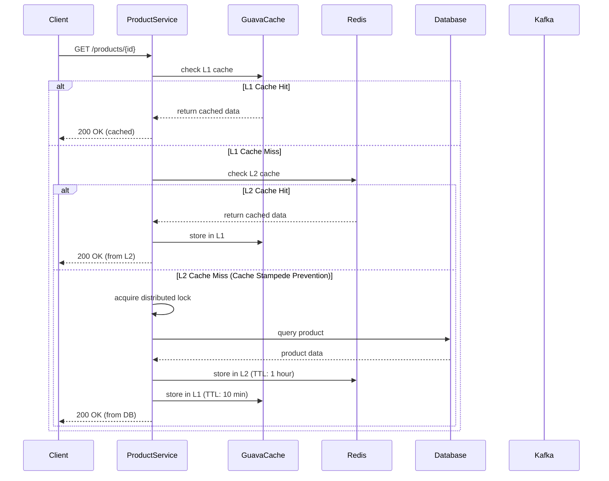
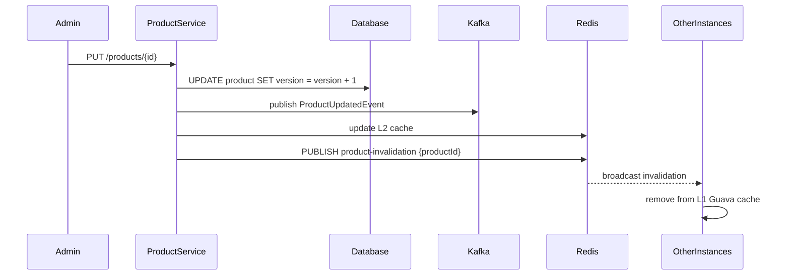

# Tài liệu Thiết kế Kỹ thuật: Product Service

*Được tạo: 2025-07-08 21:58:PM*

## 1. Tổng quan

Product Service là microservice cốt lõi trong hệ thống e-commerce, chịu trách nhiệm quản lý toàn bộ thông tin sản phẩm và cung cấp các API để truy vấn dữ liệu sản phẩm với hiệu suất cao. Service này được thiết kế để xử lý lượng truy cập lớn (target: 1M requests trong peak traffic) với kiến trúc caching 2 lớp (L1 Guava + L2 Redis) và hỗ trợ optimistic locking để xử lý race conditions trong môi trường distributed.

**Vai trò chính:**
- Quản lý thông tin chi tiết sản phẩm (tên, mô tả, giá, danh mục, version)
- Cung cấp REST API cho frontend applications  
- Cung cấp gRPC API cho internal service communication
- Tích hợp với Kafka event streaming cho data consistency
- Xử lý cache invalidation thông qua Redis Pub/Sub

## 2. Yêu cầu

### 2.1 Yêu cầu Chức năng

**FR1 - Product Information Management:**
- Là admin, tôi muốn có thể tạo/cập nhật/xóa thông tin sản phẩm để quản lý catalog
- Là customer, tôi muốn xem thông tin chi tiết sản phẩm để đưa ra quyết định mua hàng
- Là OrderService, tôi muốn validate giá sản phẩm với version để đảm bảo tính nhất quán

**FR2 - High Performance Data Access:**
- Là user, tôi muốn load thông tin sản phẩm < 100ms để có trải nghiệm tốt
- Hệ thống phải hỗ trợ 1000 concurrent reads mà không impact performance

**FR3 - Price Validation with Version Control:**
- OrderService phải có thể validate giá sản phẩm với version để tránh race condition
- Hệ thống phải reject order nếu giá đã thay đổi (optimistic locking)

**FR4 - Event-driven Data Synchronization:**
- Khi có cập nhật sản phẩm, hệ thống phải publish ProductUpdatedEvent
- Hệ thống phải consume InventoryUpdatedEvent để cập nhật cache

### 2.2 Yêu cầu Phi chức năng

**NFR1 - Performance:**
- Response time < 100ms cho 95% requests (P95)
- Hỗ trợ 1000 TPS đọc dữ liệu trong peak traffic
- Cache hit ratio > 90% cho L1+L2 combined

**NFR2 - Scalability:**
- Horizontal scaling: hỗ trợ ít nhất 3 instances
- Database connection pooling: max 20 connections per instance
- Stateless design để dễ dàng scale

**NFR3 - Availability:**
- 99.9% uptime (8.76 hours downtime/year)
- Graceful degradation khi Redis unavailable (fallback to DB)
- Circuit breaker cho external dependencies

**NFR4 - Security:**
- Tất cả API endpoints phải được authentication
- Input validation cho mọi request parameters
- Rate limiting: 100 requests/minute per user

**NFR5 - Data Consistency:**
- Eventual consistency thông qua event-driven architecture
- Cache invalidation < 5 seconds
- ACID compliance cho database transactions

## 3. Thiết kế Kỹ thuật

### 3.1. Thay đổi Mô hình Dữ liệu

**Entity Relationship Diagram:**

```mermaid
erDiagram
    PRODUCT {
        VARCHAR(50) id PK
        VARCHAR(255) name
        TEXT description
        DECIMAL(10,2) price
        VARCHAR(100) category
        INT version
        BOOLEAN active
        TIMESTAMP created_at
        TIMESTAMP updated_at
    }
    
    PRODUCT_CATEGORY {
        VARCHAR(50) id PK
        VARCHAR(255) name
        VARCHAR(255) description
        BOOLEAN active
        TIMESTAMP created_at
    }
    
    PRODUCT ||--|| PRODUCT_CATEGORY : belongs_to
```

**Thay đổi Schema:**
- **NEW**: Thêm trường `version` (INT) vào bảng `products` cho optimistic locking
- **NEW**: Thêm index `idx_product_version` trên (id, version)
- **NEW**: Thêm unique constraint `uk_product_id_version` trên (id, version)

### 3.2. Thay đổi API

**REST Endpoints:**

```json
GET /api/v1/products/{id}
Response: {
  "id": "PROD-001",
  "name": "iPhone 15 Pro",
  "description": "Latest iPhone",
  "price": 25000000.00,
  "category": "Electronics",
  "version": 5,
  "active": true
}

POST /api/v1/products
Request: {
  "name": "New Product",
  "description": "Product description",
  "price": 100000.00,
  "categoryId": "CAT-001"
}

PUT /api/v1/products/{id}
Request: {
  "name": "Updated Product",
  "price": 120000.00,
  "version": 5
}
```

**gRPC Service Definition:**

```proto
service ProductService {
  rpc GetProductInfo(GetProductRequest) returns (ProductResponse);
  rpc ValidatePriceWithVersion(PriceValidationRequest) returns (PriceValidationResponse);
}

message GetProductRequest {
  string productId = 1;
}

message ProductResponse {
  string id = 1;
  string name = 2;
  string description = 3;
  double price = 4;
  string category = 5;
  int32 version = 6;
  bool active = 7;
}

message PriceValidationRequest {
  string productId = 1;
  double expectedPrice = 2;
  int32 expectedVersion = 3;
}

message PriceValidationResponse {
  bool isValid = 1;
  ProductResponse currentProduct = 2;
  string errorMessage = 3;
}
```

### 3.3. Thay đổi UI

**Frontend Components:**
- `ProductDetailComponent`: Hiển thị thông tin sản phẩm với real-time price updates
- `ProductListComponent`: Grid view với pagination và filtering
- `AdminProductFormComponent`: CRUD operations cho admin

**Key Features:**
- Price change notification với visual feedback
- Optimistic UI updates với rollback capability
- Loading states cho cache misses

### 3.4. Luồng Logic

**Product Read Flow với 2-Layer Caching:**



**Cache Invalidation Flow:**



### 3.5. Caching Strategy

**L1 Cache (Guava Configuration):**
```java
// Configuration
maximumSize: 10,000 entries
expireAfterWrite: 10 minutes
expireAfterAccess: 5 minutes
refreshAfterWrite: 8 minutes
```

**L2 Cache (Redis Configuration):**
```properties
# Key pattern: product:{productId}
redis.ttl.product=3600  # 1 hour
redis.max.connections=50
redis.timeout=5000ms
```

**Cache Key Patterns:**
- **Product Info**: `product:{productId}`
- **Product List**: `product:list:{category}:{page}:{size}`
- **Invalidation Channel**: `product-invalidation`

**Cache Stampede Prevention:**
- Sử dụng Guava `LoadingCache` với single-threaded loading
- Redis distributed lock với TTL 30 seconds
- Exponential backoff cho retry logic

### 3.6. Concurrency Handling

**Optimistic Locking Strategy:**
- JPA `@Version` annotation trên Product entity
- Automatic version increment trên mỗi update
- Version validation trong gRPC calls

**Distributed Lock Implementation:**
```java
// Using Redisson
@Service
public class DistributedLockService {
    private final RedissonClient redissonClient;
    
    public <T> T executeWithLock(String lockKey, Supplier<T> action) {
        RLock lock = redissonClient.getLock(lockKey);
        try {
            if (lock.tryLock(5, 30, TimeUnit.SECONDS)) {
                return action.get();
            } else {
                throw new LockAcquisitionException("Unable to acquire lock: " + lockKey);
            }
        } finally {
            if (lock.isHeldByCurrentThread()) {
                lock.unlock();
            }
        }
    }
}
```

**Race Condition Scenarios:**
1. **Concurrent reads during cache miss**: Distributed lock ngăn chặn multiple DB calls
2. **Concurrent price updates**: Database version check + optimistic locking
3. **Cache invalidation race**: Redis Pub/Sub ensures all instances invalidate

### 3.7. Phụ thuộc

**New Dependencies:**
```xml
<!-- Caching -->
<dependency>
    <groupId>com.google.guava</groupId>
    <artifactId>guava</artifactId>
    <version>32.1.1-jre</version>
</dependency>

<!-- Redis & Distributed Locking -->
<dependency>
    <groupId>org.springframework.boot</groupId>
    <artifactId>spring-boot-starter-data-redis</artifactId>
</dependency>
<dependency>
    <groupId>org.redisson</groupId>
    <artifactId>redisson-spring-boot-starter</artifactId>
    <version>3.21.3</version>
</dependency>

<!-- gRPC -->
<dependency>
    <groupId>net.devh</groupId>
    <artifactId>grpc-spring-boot-starter</artifactId>
    <version>2.14.0.RELEASE</version>
</dependency>

<!-- Kafka -->
<dependency>
    <groupId>org.springframework.kafka</groupId>
    <artifactId>spring-kafka</artifactId>
</dependency>

<!-- Database -->
<dependency>
    <groupId>org.springframework.boot</groupId>
    <artifactId>spring-boot-starter-data-jpa</artifactId>
</dependency>
<dependency>
    <groupId>org.postgresql</groupId>
    <artifactId>postgresql</artifactId>
</dependency>
```

### 3.8. Cân nhắc Bảo mật

**Authentication & Authorization:**
- JWT token validation cho tất cả REST endpoints
- mTLS cho gRPC inter-service communication
- API key validation cho admin operations

**Input Validation:**
- Bean Validation (@Valid) cho request DTOs
- SQL injection prevention thông qua JPA parameterized queries
- XSS protection với input sanitization

**Rate Limiting:**
- Redis-based rate limiter: 100 requests/minute per user
- Circuit breaker cho external dependencies (Redis, Database)
- Request size limits: max 1MB payload

**Data Protection:**
- Sensitive data masking trong logs
- Database encryption at rest
- TLS 1.3 cho data in transit

### 3.9. Cân nhắc Hiệu suất

**Performance Optimizations:**
- Database connection pooling (HikariCP): max 20 connections
- Asynchronous event publishing với Kafka batch processing
- Lazy loading cho product relationships
- Database indexes trên frequently queried columns

**Monitoring & Metrics:**
- Cache hit/miss ratios tracking
- API response time monitoring (P50, P95, P99)
- Database query performance metrics
- JVM memory usage và garbage collection metrics

**Performance Targets:**
- API response time < 100ms (P95)
- Cache hit ratio > 90%
- Database connection utilization < 80%
- Memory usage < 2GB per instance

## 4. Kế hoạch Kiểm tra

**Unit Testing:**
- Controller layer tests với MockMvc
- Service layer tests với Mockito
- Repository layer tests với @DataJpaTest
- Cache logic tests với embedded Redis
- gRPC service tests với gRPC testing framework

**Integration Testing:**
- End-to-end API tests với TestContainers
- Kafka event publishing/consuming tests
- Redis cache integration tests
- Database transaction tests
- Circuit breaker behavior tests

**Performance Testing:**
- Load testing với 1000 concurrent users (JMeter/Gatling)
- Cache performance testing với różne hit ratios
- Database performance testing với large datasets
- Memory leak testing với extended runs

**User Acceptance Testing:**
- Product browsing scenarios
- Admin product management flows
- Price validation scenarios
- Cache invalidation verification

## 5. Câu hỏi Mở

**Q1**: Có nên implement cache warming strategy khi service startup để tránh cold start issues?

**Q2**: Database sharding strategy - có nên partition products theo category cho better performance?

**Q3**: Monitoring & alerting setup - sử dụng Prometheus/Grafana hay ELK stack?

**Q4**: SSL certificate management cho gRPC inter-service communication - manual hay automated (Let's Encrypt)?

**Q5**: Disaster recovery strategy - RPO và RTO targets cho Product Service?

## 6. Các Phương án Đã Xem xét

**Alternative 1 - Single Redis Cache (No L1 Guava):**
- **Pros**: Simpler architecture, less cache synchronization complexity
- **Cons**: Higher latency (network calls), Redis becomes SPOF
- **Decision**: Rejected - Network latency unacceptable for target performance

**Alternative 2 - Database-only với Aggressive Indexing:**
- **Pros**: No cache consistency issues, simpler deployment
- **Cons**: Cannot achieve <100ms response time target, poor scalability
- **Decision**: Rejected - Performance requirements không đạt được

**Alternative 3 - Pessimistic Locking thay vì Optimistic:**
- **Pros**: Strong consistency, no race conditions
- **Cons**: Poor performance, deadlock risks, not microservice-friendly
- **Decision**: Rejected - Conflicts với high-performance requirements

**Alternative 4 - Event Sourcing thay vì Traditional CRUD:**
- **Pros**: Complete audit trail, better for complex business logic
- **Cons**: High complexity, steep learning curve, overkill cho product management
- **Decision**: Rejected - Complexity không justify cho current requirements 